<p align="center">
  
</p>

<h1 align="center">💇‍♀️ MiraSalon KMP</h1>

<p align="center">
  <strong>Modern Salon Management Ecosystem powered by Kotlin Multiplatform.</strong>
</p>

<p align="center">
  <a href="https://kotlinlang.org/"></a>
  <a href="https://www.jetbrains.com/lp/compose-multiplatform/"></a>
  
  <a href="LICENSE"></a>
</p>

---

## About This Project
**MiraSalon** is a full-stack Kotlin Multiplatform project designed to revolutionize salon management. By leveraging **Compose Multiplatform** for the UI and a custom **Ktor Server** for the backend, MiraSalon provides a unified experience across Android, iOS, Desktop, and Web. It is built with a focus on shared business logic, reactive state management, and seamless real-time interactions.

<p align="center">
  <video src="https://github.com/imkao0/MiraSalon-KMP/raw/updated/assests-images/screenshots/mira_compressed.mp4" width="800" controls autoplay loop muted playsinline></video>
</p>

---

## Supported Features

- **User Authentication**: Secure JWT-based login for customers and staff.
- **Real-Time Booking**: Interactive calendar for appointment scheduling and management.
- **Service Catalog**: Detailed service listings with categories, pricing, and staff assignments.
- **Push Notifications**: Real-time alerts for booking updates and marketing campaigns.
- **Admin Dashboard**: Comprehensive analytics, staff scheduling, and inventory tracking.
- **Customer CRM**: Manage customer profiles, booking history, and feedback.
- **Integrated Chat**: Real-time support chat powered by Stream SDK for Desktop/JVM.
- **Marketing & Promotions**: Launch and track salon-wide campaigns and discounts.
- **Responsive Design**: Optimized layouts for mobile, tablet, and desktop screens.
- **Cross-device Sync**: Sessions and data synchronized across all user devices.

## Future Planning Features

- **Specialists Module**: Dedicated feature module for staff management, expertise showcasing, and availability scheduling.
- **Payment Integration**: Secure, unified payment gateway for booking deposits and product sales.
- **Automated Deployment**: One-click cloud deployment templates and automated CI/CD pipelines for scaling.
- **AI-Powered Insights**: Smart predictions for peak booking times and revenue forecasting.
- **AR Hair Stylist**: Virtual try-on for hair styles and colors using augmented reality.

---

## Technologies Used

### Jetpack Compose Multiplatform
- **Compose Multiplatform**: 1.11.1
- **Navigation 3**: 1.1.1
- **Material3 Adaptive**: 1.3.0-beta02

### Architecture & Logic
- **Slack Circuit**: 0.33.1
- **Cash App Molecule**: 2.2.0
- **SKIE**: 0.10.14
- **KSafe**: 2.2.1
- **Koin (DI)**: 4.0.2

### Networking & Data
- **Ktor Client**: 3.5.1
- **Stream Chat SDK**: 6.4.0 (Android) / 1.45.0 (Java/Desktop)
- **Room KMP**: 2.8.4
- **Multiplatform Settings**: 1.3.0
- **Kotlinx Serialization**: 1.9.0
- **Kotlinx Coroutines**: 1.11.0

### Backend (Ktor Server)
- **Ktor Server**: 3.5.1
- **Exposed (ORM)**: 0.59.0
- **Flyway**: 11.3.4
- **PostgreSQL Driver**: 42.7.5

### UI & Utilities
- **Coil 3**: 3.5.0
- **Kizitonwose Calendar**: 2.10.0
- **Napier (Logging)**: 2.7.1
- **Lucide Icons**: 1.1.0

---

## Screen Shots

### Mobile Screen Shots
<p align="center">
  <table>
    <tr>
      <td>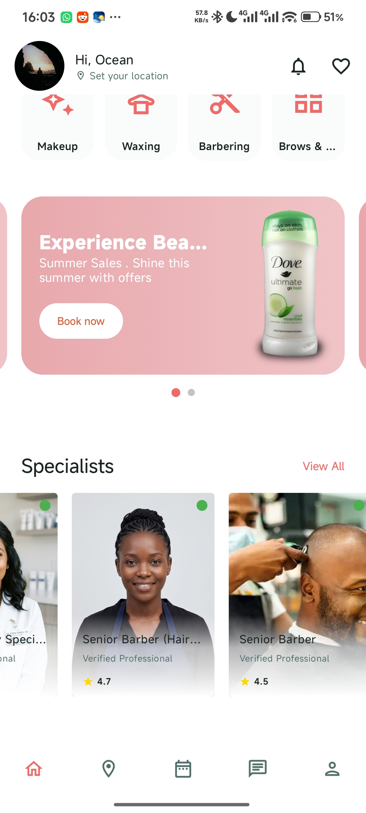<br align="center"><b>Home Screen</b></td>
      <td>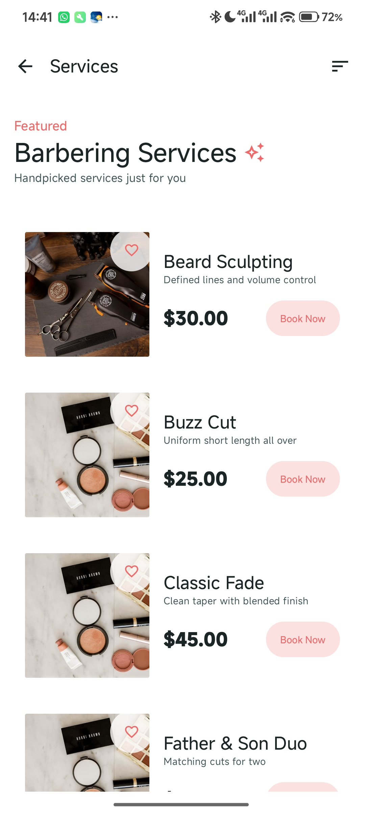<br align="center"><b>Service Catalog</b></td>
      <td>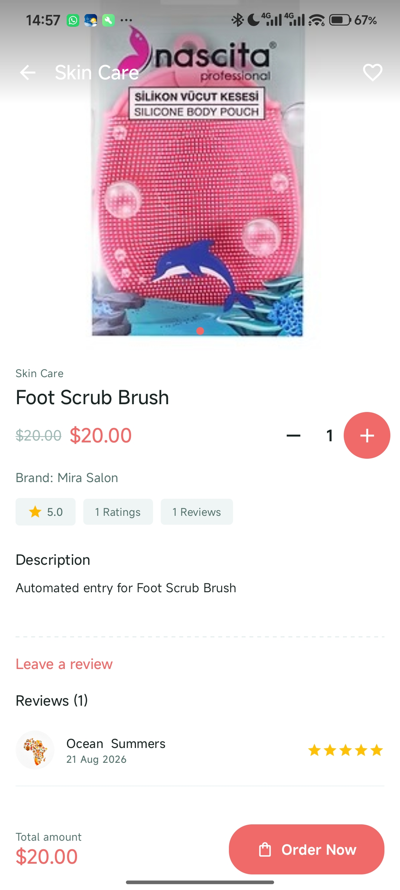<br align="center"><b>Service Details</b></td>
    </tr>
    <tr>
      <td>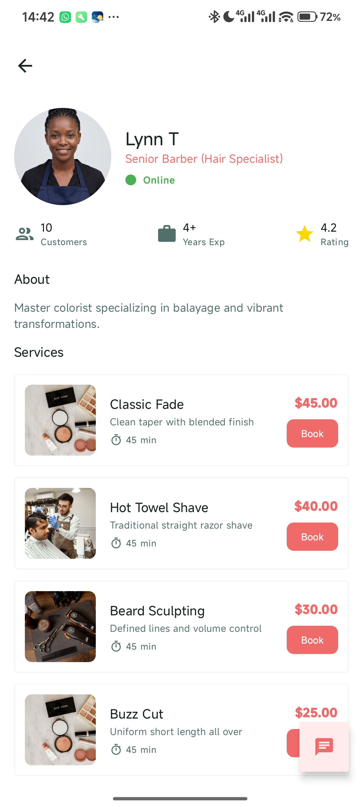<br align="center"><b>Staff Profiles</b></td>
      <td>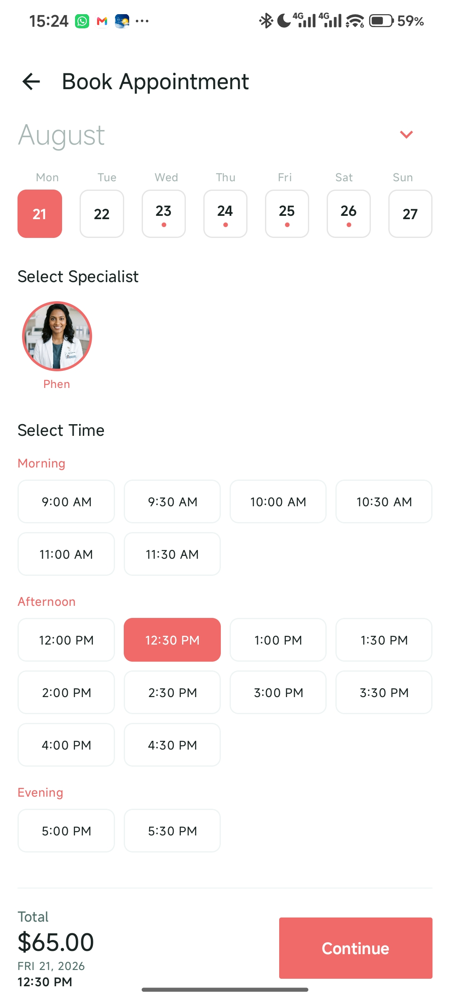<br align="center"><b>Booking Flow</b></td>
      <td>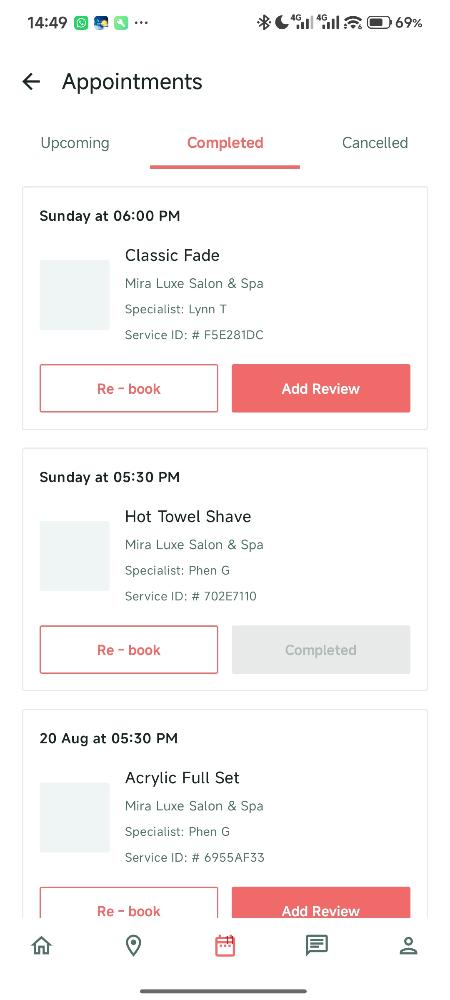<br align="center"><b>My Appointments</b></td>
    </tr>
    <tr>
      <td>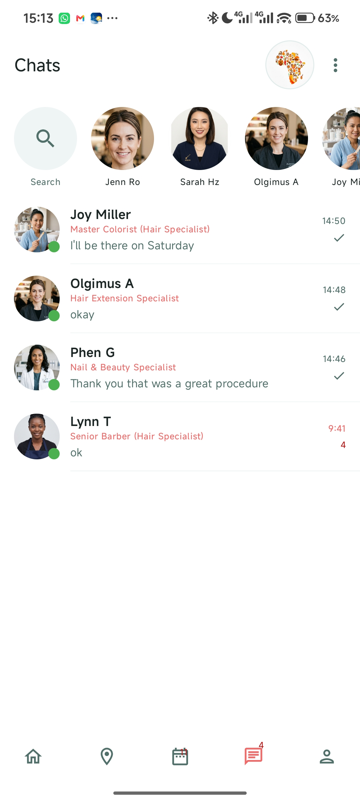<br align="center"><b>Customer Support</b></td>
      <td>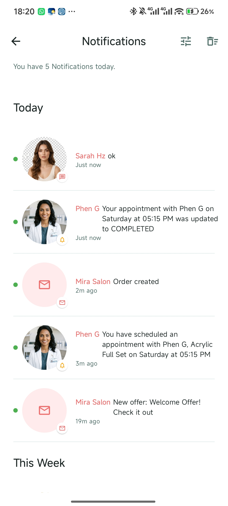<br align="center"><b>Notifications</b></td>
      <td>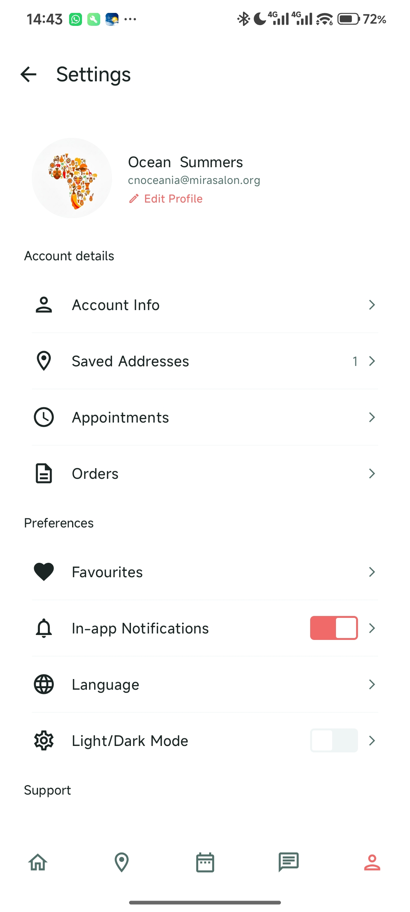<br align="center"><b>User Profile</b></td>
    </tr>
  </table>
</p>

### Desktop Screen Shots
<p align="center">
  <table>
    <tr>
      <td>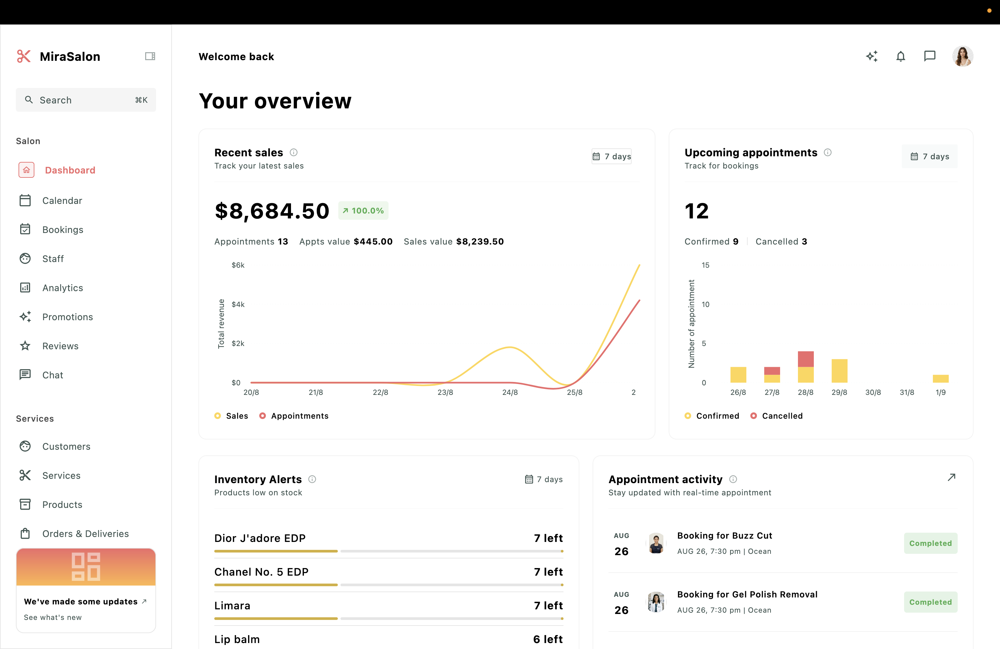<br align="center"><b>Admin Dashboard</b></td>
      <td>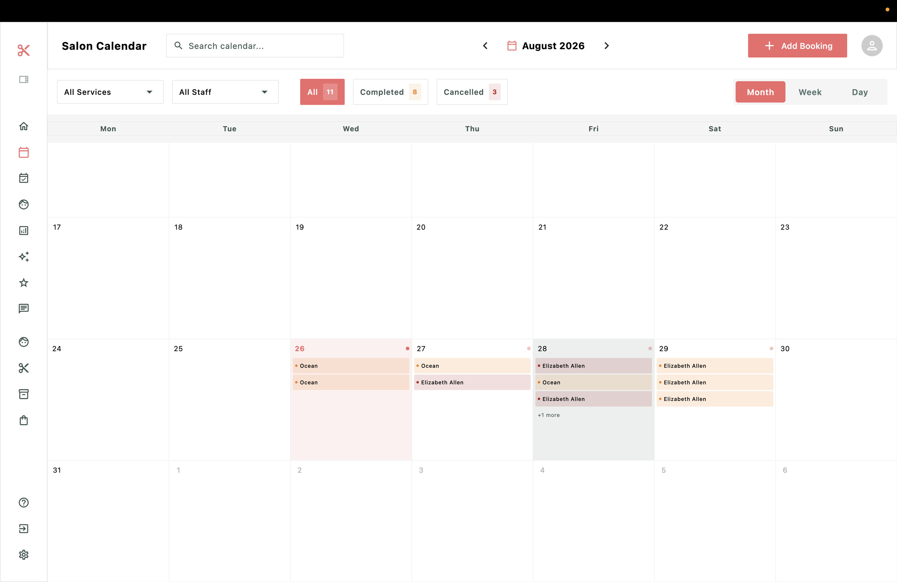<br align="center"><b>Salon Calendar</b></td>
    </tr>
    <tr>
      <td>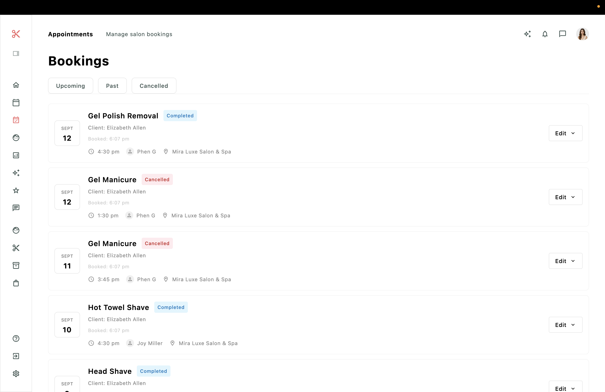<br align="center"><b>Booking Management</b></td>
      <td><br align="center"><b>Service Management</b></td>
    </tr>
    <tr>
      <td>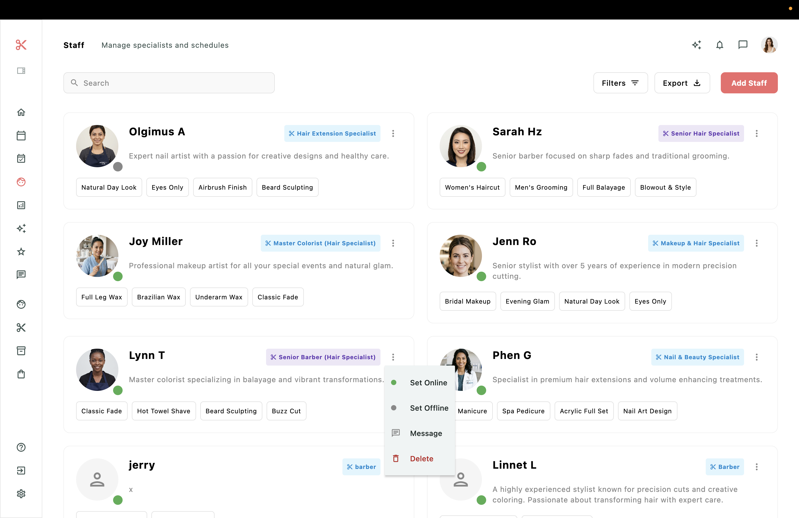<br align="center"><b>Staff Management</b></td>
      <td>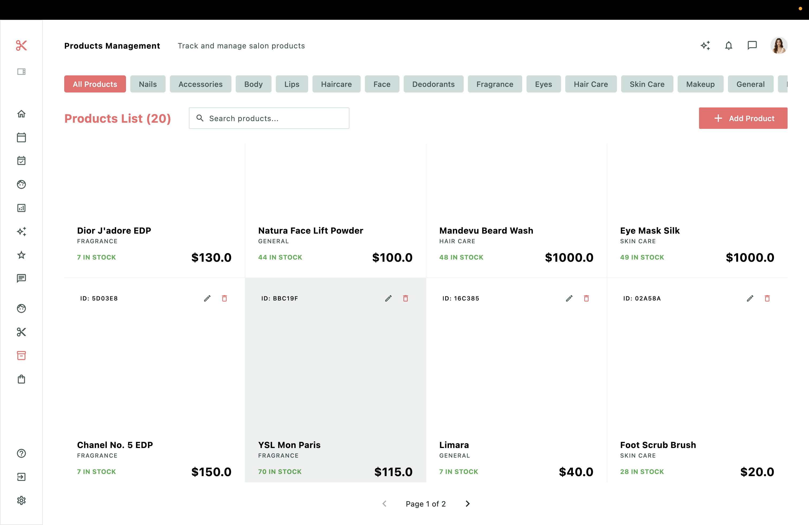<br align="center"><b>Product Catalog</b></td>
    </tr>
    <tr>
      <td>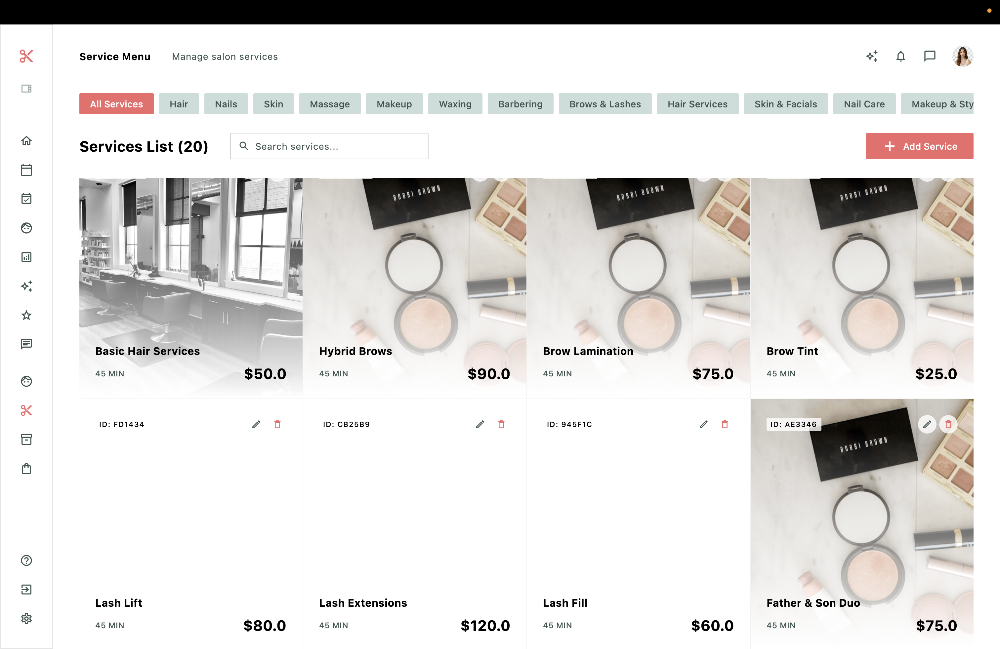<br align="center"><b>Inventory Details</b></td>
      <td>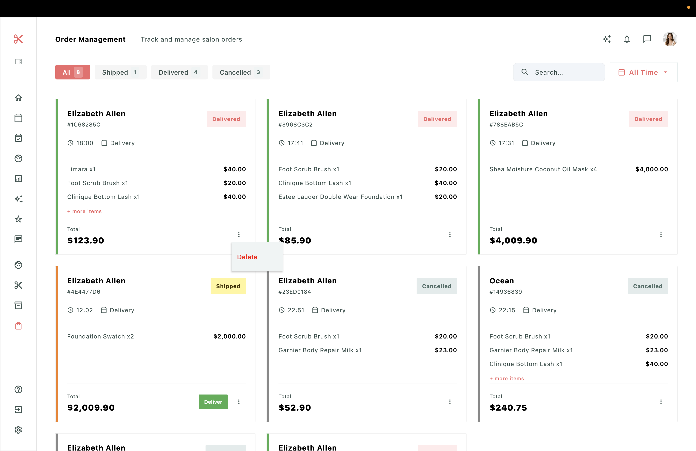<br align="center"><b>Order History</b></td>
    </tr>
    <tr>
      <td>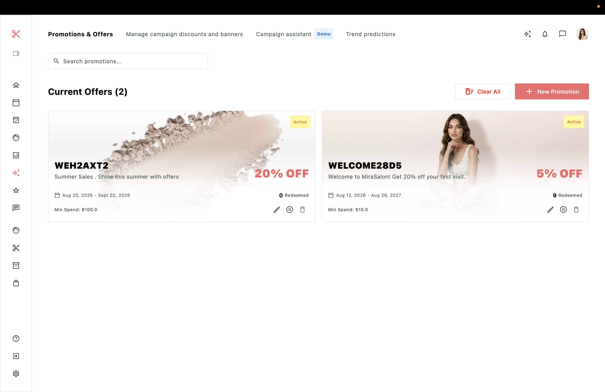<br align="center"><b>Promotions & Offers</b></td>
      <td>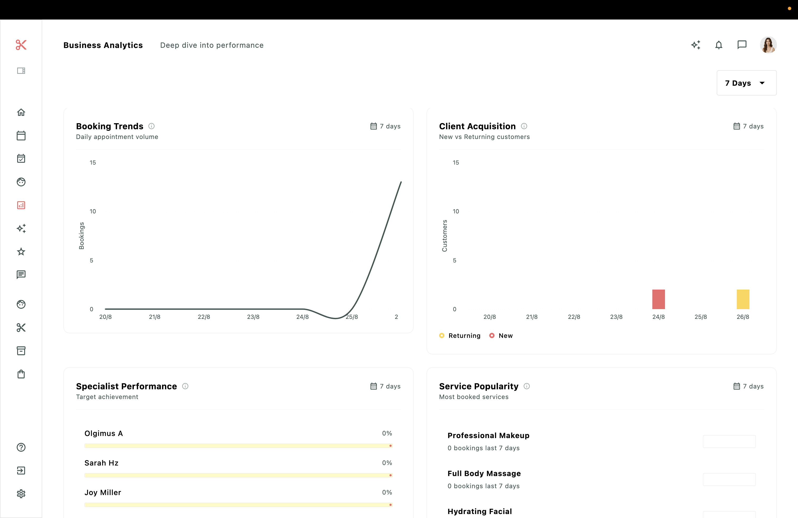<br align="center"><b>Customer Reviews</b></td>
    </tr>
  </table>
</p>

---

## Build Instruction

### Prerequisites
- JDK 17+
- Android Studio Koala+ / IntelliJ IDEA
- Xcode (for iOS)
- KDoctor (for environment check)

### Clone Repository
```bash
git clone https://github.com/imkao0/MiraSalon-KMP.git
```

### Running Backend
```bash
./gradlew :server:run
```

### Running Android
```bash
./gradlew :androidApp:installDebug
```

### Running Desktop
```bash
./gradlew :composeApp:run
```

### Running iOS
1. Open `iosApp/iosApp.xcworkspace` in Xcode.
2. Select your target device/simulator and click **Run**.

---

<p align="center">
  Made with ❤️ by <a href="https://github.com/imkao0">imkao0</a>
</p>
